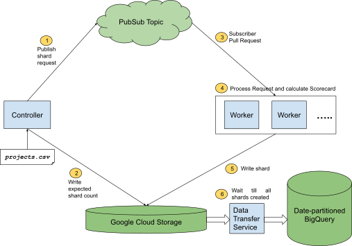
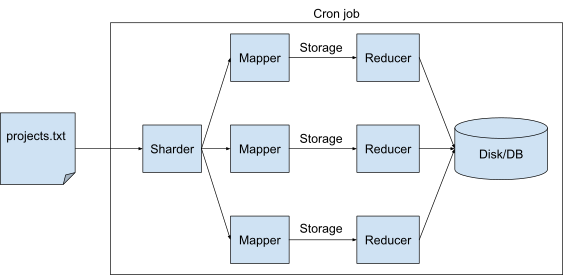
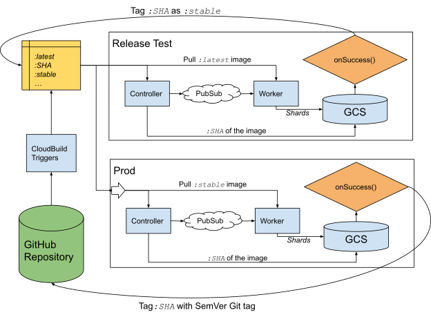

# Scalable Scorecards

Scale OSSF Scorecard to 100k+ repositories.

- Author: Azeem
- Last Updated: 2021-09-23
- Status: Complete

## Background

[Scorecard](github.com/oosf/scorecard) is an open source project by Google in
collaboration with [OpenSSF](https://openssf.org/) to automate the analysis and
trust decisions on the security posture of an open source project. As part of
this project we (Google) maintain a cron job, which calculates Scorecard results
on a predefined list of open source projects and makes it available to the
public for consumption.

The current cron/batch job runs on ~2k repositories. It utilizes a single worker
machine to process all repositories and does so by running the Scorecard
command-line tool and processing the stdout output of this tool. This has caused
us problems in the past (TODO: add links to issues) with reliability and
maintainability of this service.

The performance of this service is also questionable. It takes ~18+hrs to
process the current list of ~2k repositories. The main bottleneck here has been
the usage of GitHub tokens which are rate-limited to 5k API requests per-hour
per token. To overcome this, the current service uses 6 different tokens of
unique GitHub accounts, making our rate limit to be 30k API requests per-hour.

We propose a re-design of this service such that the underlying machine
infrastructure can handle a larger number of repositories and a more efficient
usage of GitHub tokens for better throughput. Following the Google convention,
our aim in this document is to scale the current solution by 10x and we’ll be
proposing a solution capable of handling 100k+ repositories. 


## Proposal

We propose the following work areas to help improve Scorecard scalability:

* Sharded batch job
* GitHub token optimization
* Reliability and Testing 
* Developer journey

These areas are listed in approximately decreasing order of priority. 

## Sharded Batch Job

The current cron/batch job works on ~2k repositories and utilizes a single
worker machine to process all the repositories. Below we propose an option to
provide horizontal scalability to this architecture which could help scale this
solution up further.



### PubSub architecture

All repositories to be processed will be pushed to a single PubSub Topic. Each
published request will represent a single shard to be output by the PubSub
subscribers/workers. Multiple workers can read and process requests from this
Topic independently, providing required parallelization. Every processed request
will result in a new shard being output to Google Cloud Storage. 

Pros:

* Horizontal scalability - can add more workers if needed to improve
  performance.
* Reliability - if workers go down during processing a request, requests can be
  retried easily.
* Can use Golang’s
  [generic PubSub package](https://pkg.go.dev/gocloud.dev/pubsub) to make this
  work across different cloud platforms. 

### Token Sharing

A single GitHub token cannot be used concurrently. Along with the primary rate
limit (api_requests per hour), GitHub servers apply a secondary rate limit
(abuse detection). The abuse detection mechanism gets triggered if a token is
used concurrently. Repeatedly triggering the abuse rate limits causes the token
to be bricked. To avoid this, we need to consider how the GitHub token will be
shared across workers (nodes) in an efficient way. 

We propose maintaining a *`TokenServer`* which exposes *`GetToken()`* and
*`ReleaseToken()`* RPC methods. Tokens will be provided to the service using a
Kubernetes secret which it consumes as an environment variable. The PubSub
workers use the exposed RPC method to obtain tokens for their usage. TokenServer
takes care of efficiently distributing the tokens (e.g using RoundRobin method).

### Storage and Database Schema
---
Things to consider:

* We expect that the most common query from our users would be to get the latest
  (or at a particular date) Scorecard results for a given dependency. So we’ll
  design our schema to optimize this query.
* BigQuery performs best when schema is denormalized and encourages nested
  repeated columns in schema -
  [images/scorecard_denormalization.png](images/scorecard_denormalization.png). 
* Limitation on nested repeated fields is that nesting cannot be more than 15
  levels -
  [images/scorecard_limitation_nested_fields.png](images/scorecard_limitation_nested_fields.png).
* Does it make sense to tag our results with the package version along with the
  date? It might be more useful for users to lookup Scorecard for a package by
  version rather than date?

#### BigQuery Schema

Note that below specifies the schema in Protobuf format for brevity only.

```protobuf
// BigQuerySchema

message Check {
  optional string name = 1;
  optional bool pass = 2;
  optional int confidence = 3;
}

message BigQuerySchemaV1 {
  optional string repo = 1;
  optional datetime date = 2;
  repeated Check checks = 3;
}
```

#### Partitioned Tables

BQ allows users to partition tables based on the column value of `TIMESTAMP`.
With Scorecard scaling to 100K repos and eventually to 1M, the number of rows
that will be appended periodically to the BigQuery table will be significant.
We propose partitioning the BigQuery table using the `date` field in the schema.
This will create a new partition for the day the results were calculated. This
will improve query performance and will allow users to access latest results
easily.

#### Appending Data

BQ streaming API seems limited due to quotas, constraints and language
([the efficient gRPC API is only available in Java](https://cloud.google.com/bigquery/streaming-data-into-bigquery)).
So using
[BQ Data Transfer Service](https://cloud.google.com/bigquery-transfer/docs/cloud-storage-transfer)
is currently the only viable solution.

BQ Data Transfer Service can read
[Cloud Storage URIs with wildcards](https://cloud.google.com/bigquery/docs/batch-loading-data#load-wildcards).
So each worker in our sharded batch job can write to a separate file inside a
Cloud Storage bucket. We can then setup a recurring data transfer job to load
data into BQ. 

#### Interaction With Batch Job

To make sure that BQ data transfer job and the sharded batch job interact
smoothly with each other, we propose:

* The PubSub controller owns the logic for creating shards and decides the shard
  size. This ensures that the number of shards to be expected per run are
  deterministic and available at the time of PubSub request creation.
* The PubSub controller writes the **`num_expected_shards`** from a run to the
  GCS bucket.
* The PubSub worker creates a single shard for every request it receives from
  the topic.
* BQ data transfer (BQDT) periodically reads from the GCS folder of a single run
  and initiates a transfer to BQ only if:
  **`num_expected_shards == num_created_shards`**. 
* All GCS folders created by the daily batch job will have a TTL of 15 days.
  This ensures both data backup and garbage collection.

#### View of Latest Data

We will also create a View on our BQ dataset which points to the latest
partition in the dataset. This should provide a smooth interface for users to
query the latest results.

### Alternatives Considered

#### MapReduce architecture (with intermediate storage)

The repositories to be processed could be sharded and Mapper jobs will then send
these smaller chunks of repositories to Workers. In addition, we could choose to
add a layer of intermediate storage between Mapper and Reducer (if one isn’t
already provided by the framework) to help improve reliability in case the
Mapper or Reducer worker goes down.

Pros:

* More robust than the pub sub architecture in terms of reliability.
* We can use existing MapReduce frameworks for our purpose (e.g
  [BigQuery connector](https://cloud.google.com/dataproc/docs/concepts/connectors/bigquery)).
* Horizontal scalability - easy to add more mapper/reducers.

Cons:

* No out-of-the-box solution provided by Cloud providers and will require lot of
  custom logic and service maintenance. 

Diagram:



#### BigQuery Schema

```protobuf
// BigQuerySchema

message Check {
  optional string name = 1;
  optional bool pass = 2;
  optional int confidence = 3;
}

message BigQuerySchemaV2 {
  optional string repo = 1;
  optional datetime date = 2;
  optional Check active = 3;
  optional Check reviews = 4;
  …
}
```

Pros:

* Better queriability - clients can choose to select which checks they want to
  query.
* If in future, we choose to have different structs representing different
  checks, it would be advantageous to have this structure.

Cons:

* Since each check is explicitly mentioned, adding a new check would require
  updating the BQ schema. 
* There is no performance or scalability advantage for this added complexity.

#### Token Sharing

* Per node tokens - a set of tokens will be assigned to every node which it will
  use in a round-robin way. 
    * Inefficient - tokens might be under utilized.
    * DevOps will be difficult to automate.
* Oliver Chang: every node will have access to all tokens. This reduces DevOps
  complexity at the cost of efficiency.
    * Does not allow for a high degree of parallelism.
    * This option was used in the initial development stages before moving to
      the “Token Server” option.

## GitHub Tokens

There are 2 problems with the current usage pattern of GitHub APIs in our code:

* Most checks need O(n) API calls.
* The same API call is repeated across checks.

To improve the efficiency of GitHub token usage we propose:

1. Using the GraphQL API instead of REST. This will help bring down the number
   of API calls from O(n) to O(1). 
2. Expose high-level APIs (e.g *`GetMergedPRs()`*, *`ListCommits()`* etc.) which
   under the hood cache the results for a repository and ensure there are no
   repeated calls to the same API.
3. At the architecture level, we don’t expect all repos to be changing as
   frequently as we run the Scorecard job. We should consider using
   [GitHub’s conditional requests](https://docs.github.com/en/rest/overview/resources-in-the-rest-api#conditional-requests).
   Although not all API endpoints support this today, it's a good starting
   point.

Both (1) and (2) can be achieved by implementing a *`RepoClient`* interface as
described here:
[https://github.com/ossf/scorecard/issues/462](https://github.com/ossf/scorecard/issues/462)

## Reliability and Testing

**Discussion:**
[https://github.com/ossf/scorecard/issues/651](https://github.com/ossf/scorecard/issues/651)



As part of improving the reliability of the cron, we propose setting up an
end-to-end integration testing framework. This will also serve as our release
process. We propose:

* Scorecard images will be built with *`COMMIT_SHA`* and *`latest`* tags using
  *`CloudBuild`* triggers.
* The PubSub controller will generate a *`shard_metadata`* file which will
  contain the *`COMMIT_SHA`* used to generate the shards.
* The release tests will trigger every 24 hours and use the *`latest`* tag
  binaries.
* The tests will run on a sample of the repos used during the weekly runs. 
    * There will be a separate BQ table and a successful data transfer to this
      table will be considered as the test *`successful`*. 
    * There will be sanity tests like ensuring no runtime errors occur during
      the running of the test.
    * This will not test the result quality. 
* If the release tests are *`successful`*: 
    * The release tests will trigger a webhook which tags the docker image
      corresponding to *`COMMIT_SHA`* tag with *`stable`*.
* The weekly cron job uses the *`stable`* tag binaries and goes through the same
  process as the release test. The only difference being that a *`successful`*
  run will trigger a different webhook which generates a new Git tag (using
  [SemVer](https://semver.org/)) for the associated *`COMMIT_SHA`*. 

## Developer Journeys

Scalability of a project like Scorecard greatly benefits from wider developer
usage and contributions from Open Source developers. Currently, the project is
highly developer unfriendly for anyone trying it out for the first time. Towards
this end, we need efforts to:

* Add non-hermetic tests which are not flaky and do not fail based on
  environment variables and access to GCS.
* Better unit test coverage to add confidence for any incoming PRs.
* Better documentation.