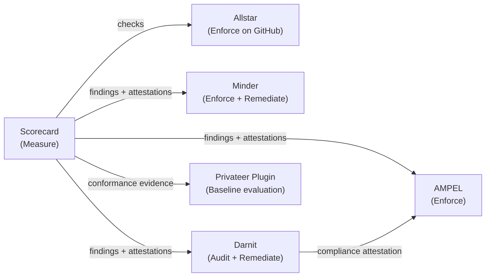
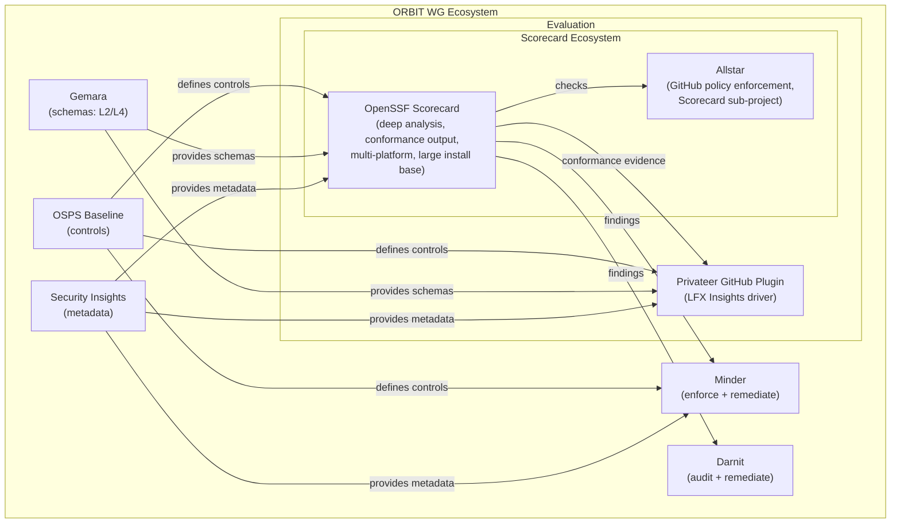

# Proposal: OSPS Baseline Conformance for OpenSSF Scorecard

## Summary

Add OSPS Baseline conformance evaluation to Scorecard, making it a credible tool for determining whether open source projects meet the security requirements defined by the Open Source Project Security (OSPS) Baseline specification. This is the central initiative for Scorecard's 2026 roadmap.

This is fundamentally a **product-level shift**: Scorecard today answers "how well does this repo follow best practices?" (graded 0-10 heuristics). OSPS conformance requires answering "does this project meet these MUST statements at this maturity level?" (PASS/FAIL/UNKNOWN/NOT_APPLICABLE per control, with evidence). The two models coexist — existing checks and scores are unchanged — but the conformance layer is a new product surface.

## Motivation

### Why now

1. **OSPS Baseline is the emerging standard.** The OSPS Baseline (v2026.02.19) defines controls across 3 maturity levels. It is maintained within the ORBIT Working Group and is becoming the reference framework for open source project security posture. See the [OSPS Baseline maintenance process](https://baseline.openssf.org/maintenance.html) for the versioning cadence.

2. **The ecosystem is moving.** The [Privateer plugin for GitHub repositories](https://github.com/ossf/pvtr-github-repo-scanner) already evaluates 39 of 52 control requirements and powers LFX Insights security results. The OSPS Baseline GitHub Action can upload SARIF. Best Practices Badge is staging Baseline-phase work. Scorecard's large install base is an advantage, but only if it ships a conformance surface.

3. **ORBIT WG alignment.** Scorecard sits within the OpenSSF alongside the ORBIT WG. The ORBIT charter's mission is "to develop and maintain interoperable resources related to the identification and presentation of security-relevant data." Scorecard producing interoperable conformance results is a natural fit.

4. **Regulatory pressure.** The EU Cyber Resilience Act (CRA) and similar regulatory frameworks increasingly expect evidence-based security posture documentation. OSPS Baseline conformance output positions Scorecard as a tool that produces CRA-relevant evidence artifacts.

### What Scorecard brings that others don't

- **Deep automated analysis.** 50+ probes with structured results provide granular evidence that the Privateer GitHub plugin's shallower checks cannot match (e.g., per-workflow token permission analysis, detailed branch protection rule inspection, CI/CD injection pattern detection).
- **Multi-platform support.** GitHub, GitLab, Azure DevOps, and local directory scanning.
- **Massive install base.** Scorecard Action, public API, and cron-based scanning infrastructure.
- **Existing policy machinery.** The `policy/` package and structured results were designed for exactly this kind of downstream consumption.

### Ecosystem tooling comparison

Several tools operate in adjacent spaces. Understanding their capabilities clarifies what is and isn't Scorecard's job.

| Dimension | **Scorecard** | **[Allstar](https://github.com/ossf/allstar)** | **[Minder](https://github.com/mindersec/minder)** | **[Darnit](https://github.com/kusari-oss/darnit)** | **[AMPEL](https://github.com/carabiner-dev/ampel)** | **[Privateer GitHub Plugin](https://github.com/ossf/pvtr-github-repo-scanner)** |
|-----------|--------------|---------|---------|-----------|-----------|-------------|
| **Purpose** | Security health measurement | GitHub policy enforcement | Policy enforcement + remediation platform | Compliance audit + remediation | Attestation-based policy enforcement | Baseline conformance evaluation |
| **Action** | Analyzes repositories (read-only) | Monitors orgs, opens issues, auto-fixes settings | Enforces policies, auto-remediates | Audits + fixes repositories | Verifies attestations against policies | Evaluates repos against OSPS controls |
| **Data source** | Collects from APIs/code | Collects from GitHub API + runs Scorecard checks | Collects from APIs + consumes findings from other tools | Analyzes repo state | Consumes attestations only | Collects from GitHub API + Security Insights |
| **Output** | Scores (0-10) + probe findings | GitHub issues + auto-remediated settings | Policy evaluation results + remediation PRs | PASS/FAIL + attestations + fixes | PASS/FAIL + results attestation | Gemara L4 assessment results |
| **OSPS Baseline** | Partial (via probes) | Indirect (enforces subset via Scorecard checks) | Via Rego policy rules | Full (62 controls) | Via policy rules | 39 of 52 controls |
| **In-toto** | Produces attestations | N/A | Consumes attestations | Produces attestations | Consumes + verifies | N/A |
| **OSCAL** | No | No | No | No | Native support | N/A |
| **Sigstore** | No | No | Verifies signatures | Signs attestations | Verifies signatures | N/A |
| **Gemara** | Not yet (planned) | No | No | No | No | L2 + L4 native |
| **Maturity** | Production (v5.3.0) | Production (v4.5, Scorecard sub-project) | Sandbox (OpenSSF, donated Oct 2024) | Alpha (v0.1.0, Jan 2026) | Production (v1.0.0) | Production, powers LFX Insights |
| **Language** | Go | Go | Go | Python | Go | Go |

**Integration model:**

Scorecard is the **data source** (measures repository security). [Allstar](https://github.com/ossf/allstar) is a Scorecard sub-project that continuously monitors GitHub organizations and enforces Scorecard check results as policies (opening issues or auto-remediating settings). Minder consumes Scorecard findings to enforce policies and auto-remediate across repositories. Darnit audits compliance and remediates. AMPEL enforces policies on attestations. The Privateer plugin evaluates Baseline conformance. They are complementary, not competing.

### What Scorecard must not do

- **Duplicate the Privateer plugin's role.** The [Privateer plugin for GitHub repositories](https://github.com/ossf/pvtr-github-repo-scanner) is the Baseline evaluator in the ORBIT ecosystem. Scorecard should complement it with deeper analysis and interoperable output, not fork the evaluation model.
- **Duplicate policy enforcement or remediation.** [Minder](https://github.com/mindersec/minder) (OpenSSF Sandbox project, ORBIT WG) consumes Scorecard findings and enforces security policies across repositories with auto-remediation. Scorecard produces findings for Minder to act on.
- **Duplicate compliance auditing.** Darnit handles compliance auditing and automated remediation (PR creation, file generation, AI-assisted fixes). Scorecard is read-only.
- **Duplicate attestation policy enforcement.** AMPEL verifies attestations against policies and gates CI/CD pipelines. Scorecard *produces* attestations for AMPEL to consume.
- **Turn OSPS controls into Scorecard checks.** OSPS conformance is a layer that consumes existing Scorecard signals, not 59 new checks.

## Current state

### Coverage snapshot

A fresh analysis of Scorecard's current coverage against OSPS Baseline v2026.02.19 is tracked in `docs/osps-baseline-coverage.md`. Previous coverage estimates against older Baseline versions should be treated as out-of-date.

### Existing Scorecard surfaces that matter

- **Checks** produce 0-10 scores — useful as signal but not conformance results
- **Probes** produce structured boolean findings — the right granularity for control mapping
- **Output formats** (JSON, SARIF, probe, in-toto) — OSPS output is a new format alongside these
- **[Allstar](https://github.com/ossf/allstar)** (Scorecard sub-project) — continuously monitors GitHub organizations and enforces Scorecard checks as policies with auto-remediation. Allstar already enforces several controls aligned with OSPS Baseline (branch protection, security policy, binary artifacts, dangerous workflows). OSPS conformance output could enable Allstar to enforce Baseline conformance at the organization level.
- **Multi-repo scanning** (`--repos`, `--org`) — needed for OSPS-QA-04.02 (subproject conformance)
- **Serve mode** — HTTP surface for pipeline integration

## Open questions from maintainer review

The following questions were raised by Spencer (Steering Committee member) during review of the roadmap and need to be resolved before or during implementation:

### OQ-1: Attestation mechanism identity

> "The attestation/provenance layer. What is doing the attestation? Is this some OIDC? A personal token? A workflow (won't have the right tokens)?"
> — Spencer, on Section 5.1

This is a fundamental design question. Options include:
- **Repo-local metadata files** (e.g., Security Insights, `.osps-attestations.yml`): simplest, no cryptographic identity, maintainer self-declares by committing the file.
- **Signed attestations via Sigstore/OIDC**: strongest guarantees, but requires workflow identity and the right tokens — which Spencer correctly notes may not be available in all contexts.
- **Platform-native signals**: e.g., GitHub's private vulnerability reporting enabled status, which the platform attests implicitly.

**Recommendation to discuss**: Start with repo-local metadata files (unsigned) for the v1 attestation mechanism, with a defined extension point for signed attestations in a future iteration. This avoids blocking on the identity question while still making non-automatable controls reportable.

### OQ-2: Scorecard's role in enforcement detection vs. enforcement

> "I thought the other doc said Scorecard wasn't an enforcement tool?"
> — Spencer, on Q4 deliverables (enforcement detection)

This is a critical framing question. The roadmap proposes *detecting* whether enforcement exists (e.g., "are SAST results required to pass before merge?"), not *performing* enforcement. But the line between "detecting enforcement" and "being an enforcement tool" needs to be drawn clearly.

**Recommendation to discuss**: Scorecard detects and reports whether enforcement mechanisms are in place. It does not itself enforce. The `--fail-on=fail` CI gating is a reporting exit code, not an enforcement action — the CI system is the enforcer. This distinction should be documented explicitly.

### OQ-3: `scan_scope` field in output schema

> "Not sure I see the importance [of `scan_scope`]"
> — Spencer, on Section 9 (output schema)

The `scan_scope` field (repo|org|repos) in the proposed OSPS output schema may not carry meaningful information. If the output always describes a single repository's conformance, the scope is implicit.

**Recommendation to discuss**: Drop `scan_scope` from the schema unless multi-repo aggregation (OSPS-QA-04.02) produces a fundamentally different output shape. Revisit in Q4 when project-level aggregation is implemented.

### OQ-4: Evidence model — probes only, not checks

> "[Evidence] should be probe-based only, not check"
> — Spencer, on Section 9 (output schema)

Spencer's position is that OSPS evidence references should point to probe findings, not check-level results. This aligns with the architectural direction of Scorecard v5 (probes as the measurement unit, checks as scoring aggregations).

**Recommendation**: Adopt this. The `evidence` array in the OSPS output schema should reference probes and their findings only. Checks may be listed in a `derived_from` field for human context but are not evidence.

## Scope

### In scope

1. **OSPS conformance engine** — new package that maps controls to Scorecard probes, evaluates per-control status, handles applicability
2. **OSPS output format** — `--format=osps` producing a JSON conformance report
3. **Versioned mapping file** — data-driven YAML mapping OSPS control IDs to Scorecard probes, applicability rules, and evaluation logic
4. **Applicability engine** — detects preconditions (e.g., "has made a release") and outputs NOT_APPLICABLE
5. **Security Insights ingestion** — reads `security-insights.yml` to satisfy metadata-dependent controls, aligning with the ORBIT ecosystem data plane; provides degraded-but-useful evaluation when absent
6. **Attestation mechanism (v1)** — accepts repo-local metadata for non-automatable controls (pending OQ-1 resolution)
7. **Scorecard control catalog extraction** — plan and mechanism to make Scorecard's control definitions consumable by other tools
8. **New probes and probe enhancements** for gap controls:
   - Secrets detection (OSPS-BR-07.01)
   - Governance/docs presence (OSPS-GV-02.01, GV-03.01, DO-01.01, DO-02.01)
   - Dependency manifest presence (OSPS-QA-02.01)
   - Security policy deepening (OSPS-VM-02.01, VM-03.01, VM-01.01)
   - Release asset inspection (multiple L2/L3 controls)
   - Signed manifest support (OSPS-BR-06.01)
   - Enforcement detection (OSPS-VM-05.*, VM-06.* — pending OQ-2 resolution)
9. **CI gating** — `--fail-on=fail` exit code for pipeline integration
10. **Multi-repo project-level conformance** (OSPS-QA-04.02)
11. **Gemara SDK integration** — output structurally compatible with ORBIT assessment result schemas; invest in Gemara SDK for multi-tool consumption

### Out of scope

- Policy enforcement and remediation (Minder's and Darnit's domain)
- Replacing the Privateer plugin for GitHub repositories
- Changing existing check scores or behavior
- OSPS Baseline specification changes (ORBIT WG's domain)

## Phased delivery

Phases are ordered by outcome, not calendar quarter. Maintainer bandwidth dictates delivery timing.

### Phase 1: Conformance foundation + Level 1 coverage

**Outcome:** Scorecard produces a useful OSPS Baseline Level 1 conformance report for any public GitHub repository, available across CLI, Action, and API surfaces.

- OSPS output format with `--format=osps`
- Versioned mapping file for OSPS Baseline v2026.02.19
- Applicability engine (detect "has made a release" and other preconditions)
- Map existing probes to OSPS controls where coverage exists today
- New probes for Level 1 gaps (prioritized by coverage impact):
  - Governance/docs presence (GV-02.01, GV-03.01, DO-01.01, DO-02.01)
  - Dependency manifest presence (QA-02.01)
  - Security policy deepening (VM-02.01, VM-03.01, VM-01.01)
  - Secrets detection (BR-07.01) — consume platform signals (e.g., GitHub secret scanning API) where possible
- Security Insights ingestion v1 (BR-03.01, BR-03.02, QA-04.01) with degraded-but-useful evaluation when absent
- CI gating: `--fail-on=fail` + coverage summary
- Design + document ORBIT interop commitments (Security Insights, Gemara compatibility, Privateer complementarity)
- Scorecard control catalog extraction plan (enabling other tools to consume Scorecard's control definitions)

### Phase 2: Release integrity + Level 2 core

**Outcome:** Scorecard evaluates release-related OSPS controls, covering the core of Level 2 and becoming useful for downstream due diligence workflows.

- Release asset inspection layer (detect compiled assets, SBOMs, licenses with releases)
- Signed manifest support (BR-06.01)
- Release notes/changelog detection (BR-04.01)
- Attestation mechanism v1 for non-automatable controls (pending OQ-1 resolution)
- Evidence bundle output v1 (OSPS result JSON + in-toto statement + SARIF for failures)
- Gemara SDK integration for interoperable output

### Phase 3: Enforcement detection + Level 3 + multi-repo

**Outcome:** Scorecard covers Level 3 controls including enforcement detection and project-level aggregation.

- SCA policy + enforcement detection (VM-05.* — pending OQ-2 resolution)
- SAST policy + enforcement detection (VM-06.* — pending OQ-2 resolution)
- Multi-repo project-level conformance aggregation (QA-04.02)
- Attestation integration GA

## Relationship to ORBIT ecosystem

**Scorecard's role**: Produce deep, probe-based conformance evidence that the Privateer plugin, Minder, and downstream consumers can use. Scorecard reads Security Insights (shared data plane), outputs Gemara L4-compatible results (shared schema), and fills analysis gaps where the Privateer plugin has `NotImplemented` steps.

**What Scorecard does NOT do**: Replace the Privateer plugin, enforce policies or remediate (Minder's role), or perform compliance auditing and remediation (Darnit's role).

## Success criteria

1. `scorecard --format=osps --osps-level=1` produces a valid conformance report for any public GitHub repository
2. OSPS Baseline Level 1 conformance is achieved (Phase 1 outcome)
3. OSPS output is available across CLI, Action, and API surfaces
4. OSPS output is consumable by the Privateer plugin as supplementary evidence (validated with ORBIT WG)
5. All four open questions (OQ-1 through OQ-4) are resolved with documented decisions
6. No changes to existing check scores or behavior

## Approval process

- **[blocking]** Sign-off from Stephen Augustus and Spencer (Steering Committee)
- **[blocking]** Review from at least 1 non-Steering Scorecard maintainer
- **[non-blocking]** Reviews from maintainers of tools in the WG ORBIT ecosystem
- **[informational]** Notify WG ORBIT members (TAC sign-off not required)

---

## Maintainer review

### Stephen's notes

<!-- Stephen: Use this section to record your overall impressions, concerns,
     and positions on the proposal. Edit freely — this is your space. -->

**Overall assessment:**

**Key concerns or risks:**

**Things I agree with:**

**Things I disagree with or want to change:**

- "PVTR" is shorthand for "Privateer". Throughout this proposal it makes it appear as if https://github.com/ossf/pvtr-github-repo-scanner is separate from Privateer, when it is really THE Privateer plugin for GitHub repositories. Any references to PVTR should be corrected.
- This proposal does not contain an even consideration of the capabilities of [Darnit](https://github.com/kusari-oss/darnit) and [AMPEL](https://github.com/carabiner-dev/ampel). We should do that comparison to get a better idea of what should be in or out of scope for Scorecard.
- The timeline that is in this proposal is not accurate, as we're already about to enter Q2 2026. We should focus on phases and outcomes, and let maintainer bandwidth dictate delivery timing.
- Scorecard has an existing set of checks and probes, which is essentially a control catalog. We should make a plan to extract the Scorecard control catalog so that it can be used by other tools that can handle evaluation tasks.
- Use Mermaid when creating diagrams.
- We need to understand what level of coverage Scorecard currently has for OSPS Baseline and that analysis should be created in a separate file (in `docs/`). Assume that any existing findings are out-of-date.
- `docs/roadmap-ideas.md` will not be committed to the repo, as it is a rough draft which needs to be refined for public consumption. We should create `docs/ROADMAP.md` with a 2026 second-level heading with contains the publicly-consummable roadmap.

**Priority ordering — what matters most to ship first:**

### Clarifying questions

The following questions need your input before this proposal can move to design. Please fill in your response under each question.

#### CQ-1: Scorecard as a conformance tool — product identity

The proposal frames this as a "product-level shift" where Scorecard gains a second mode: conformance evaluation alongside its existing scoring. Does this framing match your vision, or do you see conformance as eventually *replacing* the scoring model? Should we be thinking about deprecating 0-10 scores long-term, or do both modes coexist indefinitely?

**Stephen's response:**

I believe the scoring model will continue to be useful to consumers and it should be maintained. For now, both modes should coexist. There is no need to make a decision about this for the current iteration of the proposal.

#### CQ-2: OSPS Baseline version targeting

The roadmap previously targeted OSPS Baseline v2025-10-10. The Privateer GitHub plugin targets v2025-02-25. The Baseline is a living spec with periodic releases. How should Scorecard handle version drift? Options:
- Support only the latest version at any given time
- Support multiple versions concurrently via the versioned mapping file
- Pin to a version and update on a defined cadence (e.g., quarterly)

**Stephen's response:**

The current version of the OSPS Baseline is [v2026.02.19](https://baseline.openssf.org/versions/2026-02-19).

We should align with the latest version at first and have a process for aligning with new versions on a defined cadence. We should understand the [OSPS Baseline maintenance process](https://baseline.openssf.org/maintenance.html) and align with it.

The OSPS Baseline [FAQ](https://baseline.openssf.org/faq.html) and [Implementation Guidance for Maintainers](https://baseline.openssf.org/maintainers.html) may have guidance we should consider incorporating.

#### CQ-3: Security Insights as a hard dependency

Many OSPS controls depend on Security Insights data (official channels, distribution points, subproject inventory, core team). The Privateer GitHub plugin treats the Security Insights file as nearly required — most of its evaluation steps begin with `HasSecurityInsightsFile`.

Should Scorecard:
- Treat Security Insights the same way (controls that need it go UNKNOWN without it)?
- Provide a degraded but still useful evaluation without it?
- Accept alternative metadata sources (e.g., `.project`, custom config)?

This also raises a broader adoption question: most projects today don't have a `security-insights.yml`. How do we avoid making the OSPS output useless for the majority of repositories?

**Stephen's response:**

We should provide a degraded, but still-useful evaluation without a Security Insights file, especially since our probes today can already cover a lot of ground without it. It would be good for us to eventually support alternative metadata sources, but this should not be an immediate goal.

#### CQ-4: PVTR relationship — complement vs. converge

The proposal positions Scorecard as complementary to the Privateer plugin. But there's a deeper question: should this stay as two separate tools indefinitely, or is the long-term goal convergence (e.g., the Privateer plugin consuming Scorecard as a library, or Scorecard becoming a Privateer plugin itself)? Your position on this affects how tightly we couple the output formats and whether we invest in Gemara SDK integration.

**Stephen's response:**

Multiple tools should be able to consume Scorecard, so yes, we should invest in Gemara SDK integration.

#### CQ-5: Scope of new probes in 2026

The roadmap calls for significant new probe development (secrets detection, governance/docs presence, dependency manifests, release asset inspection, enforcement detection). That's a lot of new surface area. Should we:
- Build all of these within Scorecard?
- Prioritize a subset and defer the rest?
- Look for ways to consume signals from external tools (e.g., GitHub's secret scanning API, SBOM tools) rather than building detection from scratch?

If prioritizing, which new probes matter most to you?

**Stephen's response:**

We should prioritize OSPS Baseline Level 1 conformance work.
We should consider any signals that can be consumed from external sources.

#### CQ-6: Community and governance process

This is a major initiative touching Scorecard's product direction. What's the governance process for getting this approved?
- Does this need a formal proposal to the Scorecard maintainer group?
- Should this be presented at an ORBIT WG meeting?
- Do we need sign-off from the OpenSSF TAC?
- Who else beyond you and Spencer needs to weigh in?

**Stephen's response:**

We should have Stephen and Spencer sign off on this proposal as Steering Committee members. In addition, we should have reviews from:
- [blocking] At least 1 non-Steering Scorecard maintainer
- [non-blocking] Maintainers of tools in the WG ORBIT ecosystem

This does not require review from the TAC, but we should inform WG ORBIT members.

#### CQ-7: The "minimum viable conformance report"

If we had to ship the smallest useful thing in Q1, what would it be? The roadmap proposes the full OSPS output format + mapping file + applicability engine. But a simpler starting point might be:
- Just the mapping file (documentation-only, no runtime)
- A `--format=osps` that only reports on controls Scorecard already covers (no new probes, lots of UNKNOWN)
- Something else?

What would make Q1 a success in your eyes?

**Stephen's response:**

As previously mentioned, the quarterly targets are not currently accurate. One of our Q2 outcomes should be OSPS Baseline Level 1 conformance.

#### CQ-8: Existing Scorecard Action and API impact

Scorecard runs at scale via the Scorecard Action (GitHub Action) and the public API (api.scorecard.dev). Should OSPS conformance be available through these surfaces from day one, or should it start as a CLI-only feature? The API and Action have their own release and stability considerations.

**Stephen's response:**

We need to land these capabilities for as much surface area as possible.

#### CQ-9: Coverage analysis and Phase 1 scope validation

The coverage analysis (`docs/osps-baseline-coverage.md`) identifies 25 Level 1 controls. Of those, 6 are COVERED, 8 are PARTIAL, 9 are GAP, and 2 are NOT_OBSERVABLE. The Phase 1 plan targets closing the 9 GAP controls. Given that 2 controls (AC-01.01, AC-02.01) are NOT_OBSERVABLE without org-admin tokens, should Phase 1 explicitly include work on improving observability (e.g., documenting what tokens are needed, or providing guidance for org admins), or should those controls remain UNKNOWN until a later phase?

**Stephen's response:**

#### CQ-10: Mapping file ownership and contribution model

The versioned mapping file (e.g., `pkg/osps/mappings/v2026-02-19.yaml`) is a critical artifact that defines which probes satisfy which OSPS controls. Who should own this file? Options:
- Scorecard maintainers only (changes require maintainer review)
- Community-contributed with maintainer approval (like checks/probes today)
- Co-maintained with ORBIT WG members who understand the Baseline controls

This also affects how we handle disagreements about whether a probe truly satisfies a control.

**Stephen's response:**

#### CQ-11: Backwards compatibility of OSPS output format

The spec requires `--format=osps` as a new output format. Since this is a new surface, we have freedom to iterate on the schema. However, once shipped, consumers will depend on it. What stability guarantees should we offer?
- No guarantees during Phase 1 (alpha schema, may break between releases)
- Semver-like schema versioning from day one (breaking changes increment major version)
- Follow the Gemara L4 schema if one exists, inheriting its stability model

**Stephen's response:**

#### CQ-12: Probe gap prioritization for Phase 1

The coverage analysis identifies 7 Level 1 GAP controls that need new probes (excluding the 2 that depend on Security Insights). Ranked by implementation feasibility:

1. OSPS-GV-03.01 — CONTRIBUTING file presence
2. OSPS-GV-02.01 — Issues/discussions enabled
3. OSPS-DO-02.01 — Issue templates or bug report docs
4. OSPS-DO-01.01 — Documentation presence heuristics
5. OSPS-BR-07.01 — Secrets detection (platform signal consumption)
6. OSPS-BR-03.01 / BR-03.02 — Encrypted transport (requires Security Insights)
7. OSPS-QA-04.01 — Subproject listing (requires Security Insights)

Do you agree with this priority ordering? Are there any controls you would move up or down, or any you would defer to Phase 2?

**Stephen's response:**

#### CQ-13: Minder integration surface

[Minder](https://github.com/mindersec/minder) is an OpenSSF Sandbox project within the ORBIT WG that already consumes Scorecard findings to enforce security policies and auto-remediate across repositories. Minder uses Rego-based rules and can enforce OSPS Baseline controls via policy profiles. A draft Scorecard PR (#4723, now stale) attempted deeper integration by enabling Scorecard checks to be written using Minder's Rego rule engine.

Given Minder's position in the ORBIT ecosystem:
- Should the OSPS conformance output be designed with Minder as an explicit consumer (e.g., ensuring the output schema works well as Minder policy input)?
- Should we coordinate with Minder maintainers during Phase 1 to validate the integration surface?
- Is there a risk of duplicating Baseline evaluation work that Minder already does via its own rules, and if so, how should we delineate?

**Stephen's response:**

#### CQ-14: Darnit vs. Minder delineation

The proposal lists both [Darnit](https://github.com/kusari-oss/darnit) and [Minder](https://github.com/mindersec/minder) as tools that handle remediation and enforcement. Their capabilities overlap in some areas (both can enforce Baseline controls, both can remediate). For Scorecard's purposes, the distinction matters primarily for the "What Scorecard must not do" boundary.

Is the current framing correct — that Scorecard is the measurement layer and both Minder and Darnit are downstream consumers? Or should we position Scorecard differently relative to one versus the other, given that Minder is an OpenSSF project in the same working group while Darnit is not?

**Stephen's response:**

#### CQ-15: Existing issues as Phase 1 work items

The coverage analysis (`docs/osps-baseline-coverage.md`) now includes a section mapping existing Scorecard issues to OSPS Baseline gaps. Several long-standing issues align directly with Phase 1 priorities:

- [#30](https://github.com/ossf/scorecard/issues/30) — Secrets scanning (OSPS-BR-07.01), open since the project's earliest days
- [#2305](https://github.com/ossf/scorecard/issues/2305) / [#2479](https://github.com/ossf/scorecard/issues/2479) — Security Insights ingestion
- [#2465](https://github.com/ossf/scorecard/issues/2465) — Private vulnerability reporting (OSPS-VM-03.01)
- [#4824](https://github.com/ossf/scorecard/issues/4824) — Changelog check (OSPS-BR-04.01)
- [#4723](https://github.com/ossf/scorecard/pull/4723) — Minder/Rego integration draft (closed)

Should we adopt these existing issues as the starting work items for Phase 1, or create new issues that reference them? Some of these issues have significant discussion history that may contain design decisions worth preserving.

**Stephen's response:**

#### CQ-16: Allstar's role in OSPS conformance enforcement

[Allstar](https://github.com/ossf/allstar) is a Scorecard sub-project that continuously monitors GitHub organizations and enforces Scorecard check results as policies (branch protection, binary artifacts, security policy, dangerous workflows). It already enforces a subset of controls aligned with OSPS Baseline.

With OSPS conformance output, Allstar could potentially enforce Baseline conformance at the organization level — e.g., opening issues or auto-remediating when a repository falls below Level 1 conformance. Should the proposal explicitly include Allstar as a Phase 1 consumer of OSPS output, or should that be deferred? And more broadly, should Allstar be considered part of the "enforcement" boundary that Scorecard itself does not cross, even though it is a Scorecard sub-project?

**Stephen's response:**
