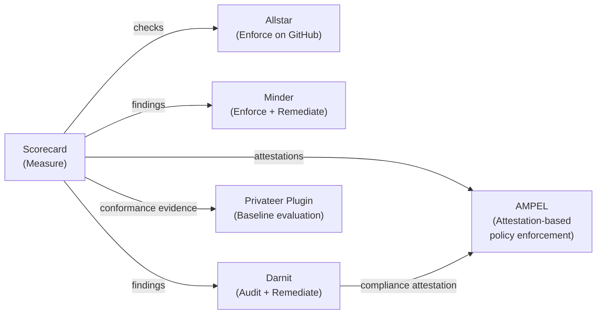
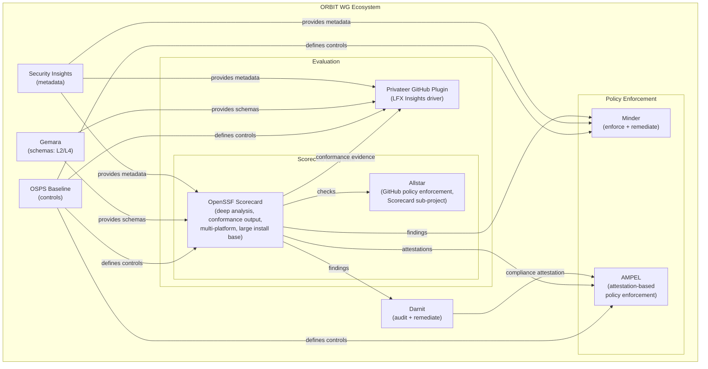

# Proposal: OSPS Baseline Conformance for OpenSSF Scorecard

## Summary

Add OSPS Baseline conformance evaluation to Scorecard, making it a credible tool for determining whether open source projects meet the security requirements defined by the Open Source Project Security (OSPS) Baseline specification. This is the central initiative for Scorecard's 2026 roadmap.

This is fundamentally a **product-level shift**: Scorecard today answers "how well does this repo follow best practices?" (graded 0-10 heuristics). OSPS conformance requires answering "does this project meet these MUST statements at this maturity level?" (PASS/FAIL/UNKNOWN/NOT_APPLICABLE per control, with evidence). The two models coexist — existing checks and scores are unchanged — but the conformance layer is a new product surface.

## Motivation

### Why now

1. **OSPS Baseline is the emerging standard.** The OSPS Baseline (v2026.02.19) defines controls across 3 maturity levels. It is maintained within the ORBIT Working Group and is becoming the reference framework for open source project security posture. See the [OSPS Baseline maintenance process](https://baseline.openssf.org/maintenance.html) for the versioning cadence.

2. **The ecosystem is moving.** The [Privateer plugin for GitHub repositories](https://github.com/ossf/pvtr-github-repo-scanner) already evaluates 39 of 52 control requirements and powers LFX Insights security results. The OSPS Baseline GitHub Action can upload SARIF. Best Practices Badge is staging Baseline-phase work. Scorecard's large install base is an advantage, but only if it ships a conformance surface.

3. **ORBIT WG alignment.** Scorecard sits within the OpenSSF alongside the ORBIT WG. The ORBIT charter's mission is "to develop and maintain interoperable resources related to the identification and presentation of security-relevant data." Scorecard producing interoperable conformance results is a natural fit.

4. **Regulatory pressure.** The EU Cyber Resilience Act (CRA) and similar regulatory frameworks increasingly expect evidence-based security posture documentation. OSPS Baseline conformance output positions Scorecard as a tool that produces CRA-relevant evidence artifacts.

### What Scorecard brings that others don't

- **Deep automated analysis.** 50+ probes with structured results provide granular evidence that the Privateer GitHub plugin's shallower checks cannot match (e.g., per-workflow token permission analysis, detailed branch protection rule inspection, CI/CD injection pattern detection).
- **Multi-platform support.** GitHub, GitLab, Azure DevOps, and local directory scanning.
- **Massive install base.** Scorecard Action, public API, and cron-based scanning infrastructure.
- **Existing policy machinery.** The `policy/` package and structured results were designed for exactly this kind of downstream consumption.

### Ecosystem tooling comparison

Several tools operate in adjacent spaces. Understanding their capabilities clarifies what is and isn't Scorecard's job.

| Dimension | **Scorecard** | **[Allstar](https://github.com/ossf/allstar)** | **[Minder](https://github.com/mindersec/minder)** | **[Darnit](https://github.com/kusari-oss/darnit)** | **[AMPEL](https://github.com/carabiner-dev/ampel)** | **[Privateer GitHub Plugin](https://github.com/ossf/pvtr-github-repo-scanner)** |
|-----------|--------------|---------|---------|-----------|-----------|-------------|
| **Purpose** | Security health measurement | GitHub policy enforcement | Policy enforcement + remediation platform | Compliance audit + remediation | Attestation-based policy enforcement | Baseline conformance evaluation |
| **Action** | Analyzes repositories (read-only) | Monitors orgs, opens issues, auto-fixes settings | Enforces policies, auto-remediates | Audits + fixes repositories | Verifies attestations against policies | Evaluates repos against OSPS controls |
| **Data source** | Collects from APIs/code | Collects from GitHub API + runs Scorecard checks | Collects from APIs + consumes findings from other tools | Analyzes repo state | Consumes attestations only | Collects from GitHub API + Security Insights |
| **Output** | Scores (0-10) + probe findings | GitHub issues + auto-remediated settings | Policy evaluation results + remediation PRs | PASS/FAIL + attestations + fixes | PASS/FAIL + results attestation | Gemara L4 assessment results |
| **OSPS Baseline** | Partial (via probes) | Indirect (enforces subset via Scorecard checks) | Via Rego policy rules | Full (62 controls) | 36 policies mapping to controls (5 consume Scorecard probes) | 39 of 52 controls |
| **In-toto** | Produces attestations | N/A | Consumes attestations | Produces attestations | Consumes + verifies | N/A |
| **OSCAL** | No | No | No | No | Native support | N/A |
| **Sigstore** | No | No | Verifies signatures | Signs attestations | Verifies signatures | N/A |
| **Gemara** | Not yet (planned) | No | No | No | No | L2 + L4 native |
| **Maturity** | Production (v5.3.0) | Production (v4.5, Scorecard sub-project) | Sandbox (OpenSSF, donated Oct 2024) | Alpha (v0.1.0, Jan 2026) | Production (v1.0.0) | Production, powers LFX Insights |
| **Language** | Go | Go | Go | Python | Go | Go |

**Integration model:**

```mermaid
flowchart LR
    Scorecard["Scorecard<br/>(Measure)"] -->|checks| Allstar["Allstar<br/>(Enforce on GitHub)"]
    Scorecard -->|findings| Minder["Minder<br/>(Enforce + Remediate)"]
    Scorecard -->|attestations| AMPEL["AMPEL<br/>(Attestation-based<br/>policy enforcement)"]
    Scorecard -->|findings| Darnit["Darnit<br/>(Audit + Remediate)"]
    Darnit -->|compliance attestation| AMPEL
    Scorecard -->|conformance evidence| Privateer["Privateer Plugin<br/>(Baseline evaluation)"]
```

Scorecard is the **data source** (measures repository security). [Allstar](https://github.com/ossf/allstar) is a Scorecard sub-project that continuously monitors GitHub organizations and enforces Scorecard check results as policies (opening issues or auto-remediating settings). [Minder](https://github.com/mindersec/minder) consumes Scorecard findings to enforce policies and auto-remediate across repositories. [AMPEL](https://github.com/carabiner-dev/ampel) validates Scorecard attestations against policies and gates CI/CD pipelines — it already maintains [production policies consuming Scorecard probe results](https://github.com/carabiner-dev/policies/tree/main/scorecard) and [OSPS Baseline policy mappings](https://github.com/carabiner-dev/policies/tree/main/groups/osps-baseline). Darnit audits compliance and remediates. The Privateer plugin evaluates Baseline conformance. They are complementary, not competing.

### What Scorecard must not do

- **Duplicate the Privateer plugin's role.** The [Privateer plugin for GitHub repositories](https://github.com/ossf/pvtr-github-repo-scanner) is the Baseline evaluator in the ORBIT ecosystem. Scorecard should complement it with deeper analysis and interoperable output, not fork the evaluation model.
- **Duplicate policy enforcement or remediation.** [Minder](https://github.com/mindersec/minder) (OpenSSF Sandbox project, ORBIT WG) consumes Scorecard findings and enforces security policies across repositories with auto-remediation. [AMPEL](https://github.com/carabiner-dev/ampel) (production v1.0.0) validates Scorecard attestations against policies and gates CI/CD pipelines — it already maintains [Scorecard-consuming policies](https://github.com/carabiner-dev/policies/tree/main/scorecard) and [OSPS Baseline mappings](https://github.com/carabiner-dev/policies/tree/main/groups/osps-baseline). Scorecard *produces* findings and attestations for Minder and AMPEL to consume.
- **Duplicate compliance auditing.** Darnit handles compliance auditing and automated remediation (PR creation, file generation, AI-assisted fixes). Scorecard is read-only.
- **Turn OSPS controls into Scorecard checks.** OSPS conformance is a layer that consumes existing Scorecard signals, not 59 new checks.

## Current state

### Coverage snapshot

A fresh analysis of Scorecard's current coverage against OSPS Baseline v2026.02.19 is tracked in `docs/osps-baseline-coverage.md`. Previous coverage estimates against older Baseline versions should be treated as out-of-date.

### Existing Scorecard surfaces that matter

- **Checks** produce 0-10 scores — useful as signal but not conformance results
- **Probes** produce structured boolean findings — the right granularity for control mapping
- **Output formats** (JSON, SARIF, probe, in-toto) — OSPS output is a new format alongside these
- **[Allstar](https://github.com/ossf/allstar)** (Scorecard sub-project) — continuously monitors GitHub organizations and enforces Scorecard checks as policies with auto-remediation. Allstar already enforces several controls aligned with OSPS Baseline (branch protection, security policy, binary artifacts, dangerous workflows). OSPS conformance output could enable Allstar to enforce Baseline conformance at the organization level.
- **Multi-repo scanning** (`--repos`, `--org`) — needed for OSPS-QA-04.02 (subproject conformance)
- **Serve mode** — HTTP surface for pipeline integration

## Open questions

Several design questions are under active discussion. Spencer (Steering
Committee) raised questions about attestation identity (OQ-1), enforcement
detection scope (OQ-2), and the evidence model (OQ-4, resolved — probe-based
only). Eddie Knight, Adolfo García Veytia, and Mike Lieberman provided
ORBIT WG feedback on output formats, mapping file ownership, and architectural
direction.

**The central open question is CQ-19: should Scorecard build its own
conformance engine (current proposal), adopt a shared plugin model with
Privateer, or take a hybrid approach?** This decision gates most other
open questions.

For the full list of questions, reviewer feedback, maintainer responses, and
decision priority analysis, see [`decisions.md`](decisions.md).

## Scope

### In scope

1. **OSPS conformance engine** — new package that maps controls to Scorecard probes, evaluates per-control status, handles applicability
2. **OSPS output format** — `--format=osps` producing a JSON conformance report
3. **Versioned mapping file** — data-driven YAML mapping OSPS control IDs to Scorecard probes, applicability rules, and evaluation logic
4. **Applicability engine** — detects preconditions (e.g., "has made a release") and outputs NOT_APPLICABLE
5. **Security Insights ingestion** — reads `security-insights.yml` to satisfy metadata-dependent controls, aligning with the ORBIT ecosystem data plane; provides degraded-but-useful evaluation when absent
6. **Attestation mechanism (v1)** — accepts repo-local metadata for non-automatable controls (pending OQ-1 resolution)
7. **Scorecard control catalog extraction** — plan and mechanism to make Scorecard's control definitions consumable by other tools
8. **New probes and probe enhancements** for gap controls:
   - Secrets detection (OSPS-BR-07.01)
   - Governance/docs presence (OSPS-GV-02.01, GV-03.01, DO-01.01, DO-02.01)
   - Dependency manifest presence (OSPS-QA-02.01)
   - Security policy deepening (OSPS-VM-02.01, VM-03.01, VM-01.01)
   - Release asset inspection (multiple L2/L3 controls)
   - Signed manifest support (OSPS-BR-06.01)
   - Enforcement detection (OSPS-VM-05.*, VM-06.* — pending OQ-2 resolution)
9. **CI gating** — `--fail-on=fail` exit code for pipeline integration
10. **Multi-repo project-level conformance** (OSPS-QA-04.02)
11. **Gemara SDK integration** — output structurally compatible with ORBIT assessment result schemas; invest in Gemara SDK for multi-tool consumption

### Out of scope

- Policy enforcement and remediation (Minder's, AMPEL's, and Darnit's domain)
- Replacing the Privateer plugin for GitHub repositories
- Changing existing check scores or behavior
- OSPS Baseline specification changes (ORBIT WG's domain)

## Phased delivery

Phases are ordered by outcome, not calendar quarter. Maintainer bandwidth dictates delivery timing.

### Phase 1: Conformance foundation + Level 1 coverage

**Outcome:** Scorecard produces a useful OSPS Baseline Level 1 conformance report for any public GitHub repository, available across CLI, Action, and API surfaces.

- OSPS output format with `--format=osps`
- Versioned mapping file for OSPS Baseline v2026.02.19
- Applicability engine (detect "has made a release" and other preconditions)
- Map existing probes to OSPS controls where coverage exists today
- New probes for Level 1 gaps (prioritized by coverage impact):
  - Governance/docs presence (GV-02.01, GV-03.01, DO-01.01, DO-02.01)
  - Dependency manifest presence (QA-02.01)
  - Security policy deepening (VM-02.01, VM-03.01, VM-01.01)
  - Secrets detection (BR-07.01) — consume platform signals (e.g., GitHub secret scanning API) where possible
- Security Insights ingestion v1 (BR-03.01, BR-03.02, QA-04.01) with degraded-but-useful evaluation when absent
- CI gating: `--fail-on=fail` + coverage summary
- Design + document ORBIT interop commitments (Security Insights, Gemara compatibility, Privateer complementarity)
- Scorecard control catalog extraction plan (enabling other tools to consume Scorecard's control definitions)

### Phase 2: Release integrity + Level 2 core

**Outcome:** Scorecard evaluates release-related OSPS controls, covering the core of Level 2 and becoming useful for downstream due diligence workflows.

- Release asset inspection layer (detect compiled assets, SBOMs, licenses with releases)
- Signed manifest support (BR-06.01)
- Release notes/changelog detection (BR-04.01)
- Attestation mechanism v1 for non-automatable controls (pending OQ-1 resolution)
- Evidence bundle output v1 (OSPS result JSON + in-toto statement + SARIF for failures)
- Gemara SDK integration for interoperable output

### Phase 3: Enforcement detection + Level 3 + multi-repo

**Outcome:** Scorecard covers Level 3 controls including enforcement detection and project-level aggregation.

- SCA policy + enforcement detection (VM-05.* — pending OQ-2 resolution)
- SAST policy + enforcement detection (VM-06.* — pending OQ-2 resolution)
- Multi-repo project-level conformance aggregation (QA-04.02)
- Attestation integration GA

## Relationship to ORBIT ecosystem

```mermaid
flowchart TD
    subgraph ORBIT["ORBIT WG Ecosystem"]
        Baseline["OSPS Baseline<br/>(controls)"]
        Gemara["Gemara<br/>(schemas: L2/L4)"]
        SI["Security Insights<br/>(metadata)"]

        subgraph Evaluation["Evaluation"]
            Privateer["Privateer GitHub Plugin<br/>(LFX Insights driver)"]
            subgraph ScorecardEcosystem["Scorecard Ecosystem"]
                Scorecard["OpenSSF Scorecard<br/>(deep analysis, conformance output,<br/>multi-platform, large install base)"]
                Allstar["Allstar<br/>(GitHub policy enforcement,<br/>Scorecard sub-project)"]
            end
        end

        subgraph Enforcement["Policy Enforcement"]
            Minder["Minder<br/>(enforce + remediate)"]
            AMPEL["AMPEL<br/>(attestation-based<br/>policy enforcement)"]
        end

        Darnit["Darnit<br/>(audit + remediate)"]
    end

    Baseline -->|defines controls| Privateer
    Baseline -->|defines controls| Scorecard
    Baseline -->|defines controls| Minder
    Baseline -->|defines controls| AMPEL
    Gemara -->|provides schemas| Privateer
    Gemara -->|provides schemas| Scorecard
    SI -->|provides metadata| Privateer
    SI -->|provides metadata| Scorecard
    SI -->|provides metadata| Minder
    Scorecard -->|checks| Allstar
    Scorecard -->|conformance evidence| Privateer
    Scorecard -->|findings| Minder
    Scorecard -->|attestations| AMPEL
    Scorecard -->|findings| Darnit
    Darnit -->|compliance attestation| AMPEL
```

**Scorecard's role**: Produce deep, probe-based conformance evidence that the Privateer plugin, Minder, AMPEL, and downstream consumers can use. Scorecard reads Security Insights (shared data plane), outputs interoperable results (shared schema), and fills analysis gaps where the Privateer plugin has `NotImplemented` steps.

**What Scorecard does NOT do**: Replace the Privateer plugin, enforce policies or remediate (Minder's and AMPEL's role), or perform compliance auditing and remediation (Darnit's role).

## Success criteria

1. `scorecard --format=osps --osps-level=1` produces a valid conformance report for any public GitHub repository
2. OSPS Baseline Level 1 conformance is achieved (Phase 1 outcome)
3. OSPS output is available across CLI, Action, and API surfaces
4. OSPS output is consumable by the Privateer plugin, AMPEL, and Minder as supplementary evidence (validated with ORBIT WG)
5. All four open questions (OQ-1 through OQ-4) are resolved with documented decisions
6. No changes to existing check scores or behavior

## Approval process

- **[blocking]** Sign-off from Stephen Augustus and Spencer (Steering Committee)
- **[blocking]** Review from at least 1 non-Steering Scorecard maintainer
- **[non-blocking]** Reviews from maintainers of tools in the WG ORBIT ecosystem
- **[informational]** Notify WG ORBIT members (TAC sign-off not required)

## Feedback, decisions, and next steps

All reviewer feedback, maintainer clarifying questions, and the decision
priority analysis are tracked in [`decisions.md`](decisions.md).
