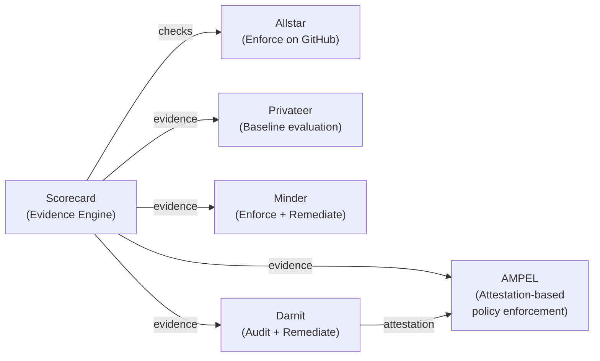
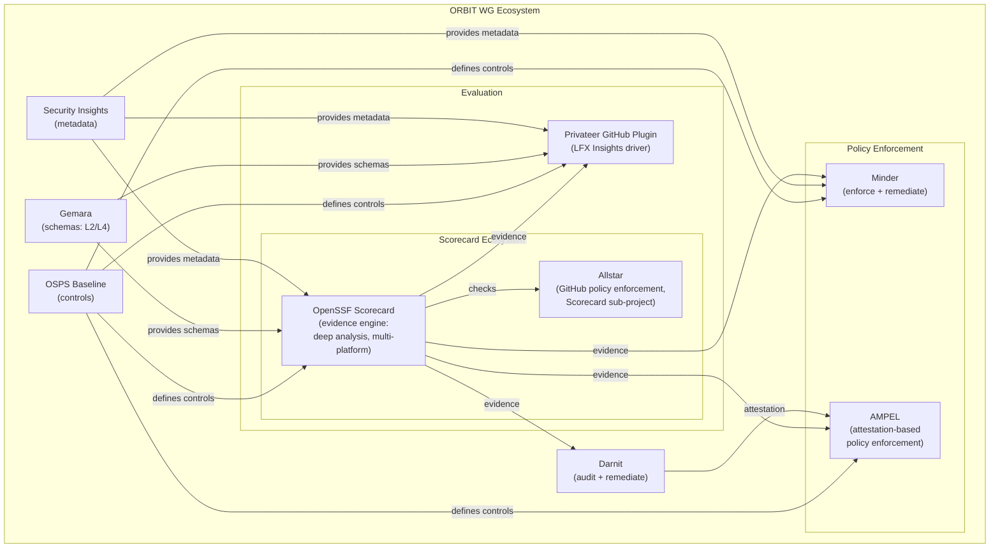

# Proposal: OSPS Baseline Conformance for OpenSSF Scorecard

## Summary

**Mission:** Scorecard produces trusted, structured security evidence for the
open source ecosystem. _(Full MVVSR to be developed as a follow-up deliverable
for Steering Committee review.)_

Scorecard is an **open source security evidence engine**. It accepts diverse
inputs about a project's security practices, normalizes them through probe-based
analysis, and packages the resulting evidence in interoperable formats for
downstream tools to act on. OSPS Baseline conformance is the first use case that
proves this architecture, and the central initiative for Scorecard's 2026
roadmap.

This is fundamentally a **product-level shift**: Scorecard today answers "how
well does this repo follow best practices?" (graded 0-10 heuristics). OSPS
conformance requires answering "does this project meet these MUST statements at
this maturity level?" (PASS/FAIL/UNKNOWN/NOT_APPLICABLE per control, with
evidence). Check scores and conformance labels are parallel evaluation layers
over the same probe evidence — existing checks and scores are unchanged.

## Motivation

### Why now

1. **OSPS Baseline is the emerging standard.** The OSPS Baseline (v2026.02.19) defines controls across 3 maturity levels. It is maintained within the ORBIT Working Group and is becoming the reference framework for open source project security posture. See the [OSPS Baseline maintenance process](https://baseline.openssf.org/maintenance.html) for the versioning cadence.

2. **The ecosystem is moving.** The [Privateer plugin for GitHub repositories](https://github.com/ossf/pvtr-github-repo-scanner) already evaluates 39 of 52 control requirements and powers LFX Insights security results. The OSPS Baseline GitHub Action can upload SARIF. Best Practices Badge is staging Baseline-phase work. Scorecard's large install base is an advantage, but only if it ships a conformance surface.

3. **ORBIT WG alignment.** Scorecard sits within the OpenSSF alongside the ORBIT WG. The ORBIT charter's mission is "to develop and maintain interoperable resources related to the identification and presentation of security-relevant data." Scorecard producing interoperable conformance results is a natural fit.

4. **Regulatory pressure.** The EU Cyber Resilience Act (CRA) and similar regulatory frameworks increasingly expect evidence-based security posture documentation. Scorecard produces structured evidence that downstream tools and processes may use when evaluating regulatory readiness. Scorecard does not itself guarantee CRA compliance or any other regulatory compliance.

### What Scorecard brings that others don't

- **Deep automated analysis.** 50+ probes with structured results provide granular evidence that the Privateer GitHub plugin's shallower checks cannot match (e.g., per-workflow token permission analysis, detailed branch protection rule inspection, CI/CD injection pattern detection).
- **Multi-platform support.** GitHub, GitLab, Azure DevOps, and local directory scanning.
- **Massive install base.** Scorecard Action, public API, and cron-based scanning infrastructure.
- **Existing policy machinery.** The `policy/` package and structured results were designed for exactly this kind of downstream consumption.

### Ecosystem tooling comparison

Several tools operate in adjacent spaces. Understanding their capabilities clarifies what is and isn't Scorecard's job.

| Dimension | **Scorecard** | **[Allstar](https://github.com/ossf/allstar)** | **[Minder](https://github.com/mindersec/minder)** | **[Darnit](https://github.com/kusari-oss/darnit)** | **[AMPEL](https://github.com/carabiner-dev/ampel)** | **[Privateer GitHub Plugin](https://github.com/ossf/pvtr-github-repo-scanner)** |
|-----------|--------------|---------|---------|-----------|-----------|-------------|
| **Purpose** | Security health measurement | GitHub policy enforcement | Policy enforcement + remediation platform | Compliance audit + remediation | Attestation-based policy enforcement | Baseline conformance evaluation |
| **Action** | Analyzes repositories (read-only) | Monitors orgs, opens issues, auto-fixes settings | Enforces policies, auto-remediates | Audits + fixes repositories | Verifies attestations against policies | Evaluates repos against OSPS controls |
| **Data source** | Collects from APIs/code | Collects from GitHub API + runs Scorecard checks | Collects from APIs + consumes findings from other tools | Analyzes repo state | Consumes attestations only | Collects from GitHub API + Security Insights |
| **Output** | Scores (0-10) + probe findings | GitHub issues + auto-remediated settings | Policy evaluation results + remediation PRs | PASS/FAIL + attestations + fixes | PASS/FAIL + results attestation | Gemara L4 assessment results |
| **OSPS Baseline** | Partial (via probes) | Indirect (enforces subset via Scorecard checks) | Via Rego policy rules | Full (62 controls) | 36 policies mapping to controls (5 consume Scorecard probes) | 39 of 52 controls |
| **In-toto** | Produces attestations | N/A | Consumes attestations | Produces attestations | Consumes + verifies | N/A |
| **OSCAL** | No | No | No | No | Native support | N/A |
| **Sigstore** | No | No | Verifies signatures | Signs attestations | Verifies signatures | N/A |
| **Gemara** | Not yet (planned) | No | No | No | No | L2 + L4 native |
| **Maturity** | Production (v5.3.0) | Production (v4.5, Scorecard sub-project) | Sandbox (OpenSSF, donated Oct 2024) | Alpha (v0.1.0, Jan 2026) | Production (v1.0.0) | Production, powers LFX Insights |
| **Language** | Go | Go | Go | Python | Go | Go |

**Integration model:**


```mermaid
flowchart LR
    Scorecard["Scorecard<br/>(Evidence Engine)"] -->|checks| Allstar["Allstar<br/>(Enforce on GitHub)"]
    Scorecard -->|evidence| Privateer["Privateer<br/>(Baseline evaluation)"]
    Scorecard -->|evidence| Minder["Minder<br/>(Enforce + Remediate)"]
    Scorecard -->|evidence| AMPEL["AMPEL<br/>(Attestation-based<br/>policy enforcement)"]
    Scorecard -->|evidence| Darnit["Darnit<br/>(Audit + Remediate)"]
    Darnit -->|attestation| AMPEL
```

Scorecard is the **evidence engine** (produces structured security evidence).
All downstream tools consume Scorecard evidence on equal terms through published
output formats. [Allstar](https://github.com/ossf/allstar) is a Scorecard
sub-project that enforces Scorecard check results as policies.
[Minder](https://github.com/mindersec/minder) enforces security policies across
repositories. [AMPEL](https://github.com/carabiner-dev/ampel) validates
attestations against policies in CI/CD pipelines — it already maintains
[policies consuming Scorecard probe results](https://github.com/carabiner-dev/policies/tree/main/scorecard)
and [OSPS Baseline policy mappings](https://github.com/carabiner-dev/policies/tree/main/groups/osps-baseline).
[Darnit](https://github.com/kusari-oss/darnit) audits compliance and
remediates. [Privateer](https://github.com/ossf/pvtr-github-repo-scanner)
evaluates Baseline conformance. They are complementary, not competing.

### What Scorecard SHOULD NOT do

Scorecard SHOULD NOT (per [RFC 2119](https://www.rfc-editor.org/rfc/rfc2119))
duplicate evaluation that downstream tools handle. There may be scenarios where
overlapping evaluation makes sense (e.g., Scorecard brings deeper analysis or
different evidence sources), but the default posture is complementarity.

- **Duplicate policy enforcement or remediation.** Downstream tools — [Privateer](https://github.com/ossf/pvtr-github-repo-scanner), [Minder](https://github.com/mindersec/minder), [AMPEL](https://github.com/carabiner-dev/ampel), [Darnit](https://github.com/kusari-oss/darnit), and others — consume Scorecard evidence through published output formats. Scorecard *produces* findings and attestations; downstream tools enforce, remediate, and audit.
- **Privilege any downstream consumer.** All tools consume Scorecard output on equal terms. No tool has a special integration relationship.
- **Turn OSPS controls into Scorecard checks.** OSPS conformance is a layer that consumes existing Scorecard signals, not 59 new checks.

## Current state

### Coverage snapshot

A fresh analysis of Scorecard's current coverage against OSPS Baseline v2026.02.19 is tracked in `docs/osps-baseline-coverage.md`. Previous coverage estimates against older Baseline versions should be treated as out-of-date.

### Existing Scorecard surfaces that matter

- **Checks** produce 0-10 scores — useful as signal but not conformance results
- **Probes** produce structured boolean findings — the right granularity for control mapping
- **Output formats** (JSON, SARIF, probe, in-toto) — conformance evidence is delivered through these and new formats (Gemara, OSCAL)
- **[Allstar](https://github.com/ossf/allstar)** (Scorecard sub-project) — continuously monitors GitHub organizations and enforces Scorecard checks as policies with auto-remediation. Allstar already enforces several controls aligned with OSPS Baseline (branch protection, security policy, binary artifacts, dangerous workflows). OSPS conformance output could enable Allstar to enforce Baseline conformance at the organization level.
- **Multi-repo scanning** (`--repos`, `--org`) — needed for OSPS-QA-04.02 (subproject conformance)
- **Serve mode** — HTTP surface for pipeline integration

## Open questions

Several design questions are under active discussion. Spencer (Steering
Committee) raised questions about attestation identity (OQ-1), enforcement
detection scope (OQ-2), and the evidence model (OQ-4, resolved — probe-based
only). Eddie Knight, Adolfo García Veytia, and Mike Lieberman provided
ORBIT WG feedback on output formats, mapping file ownership, and architectural
direction.

The central architectural question (CQ-19) has been resolved: Scorecard takes
the hybrid approach (Option C), designed so that scaling back to Option A remains
straightforward if needed. Scorecard owns all probe execution and conformance
evaluation logic. Interoperability is purely at the output layer. See the
Architecture section below and [`decisions.md`](decisions.md) for details.

For the full list of questions, reviewer feedback, maintainer responses, and
decision priority analysis, see [`decisions.md`](decisions.md).

## Architecture

### Processing model

Scorecard's processing model has four steps:

1. **Ingest** — Accept diverse signals about a project (repository APIs,
   metadata files, platform signals, external services)
2. **Analyze** — Normalize signals through probes that understand multiple
   ways to satisfy the same outcome
3. **Evaluate** — Produce parallel assessments: check scores (0-10) and
   conformance labels (PASS/FAIL/UNKNOWN)
4. **Deliver** — Package evidence in interoperable formats (JSON, in-toto,
   Gemara, SARIF, OSCAL) for downstream consumption

### Three-tier evaluation model

```
Evidence layer:    Probe findings (atomic boolean measurements)
                       |
Evaluation layers: Check scoring (0-10, existing)
                   Conformance evaluation (PASS/FAIL/UNKNOWN, new)
                       |
Output formats:    JSON, in-toto, Gemara, SARIF, OSCAL, probe, default
```

Check scores and conformance labels are *parallel interpretations* of the same
probe evidence, not competing modes. Both can appear in the same output.

### Architectural constraints

1. Scorecard owns all probe execution (non-negotiable core competency)
2. Scorecard owns its own conformance evaluation logic (mapping, PASS/FAIL,
   applicability engine all live in Scorecard)
3. Interoperability is purely at the output layer — Gemara, in-toto, SARIF,
   OSCAL are presentation formats, not architectural dependencies
4. Evaluation logic is self-contained — Scorecard can produce conformance
   results using its own probes and mappings, independent of external
   evaluation engines

**Dependency guidance:** Only adopt reasonably stable dependencies when needed.
The [security-baseline](https://github.com/ossf/security-baseline) repo is an
acceptable data dependency for control definitions (see Scope).

**Flexibility:** Under this structure, scaling back to a fully independent model
(Option A) remains straightforward — deprioritize or drop specific output
formatters without affecting the evaluation layer.

### Design principles

1. **Evidence is the product.** Scorecard's core output is structured,
   normalized probe findings. Check scores and conformance labels are parallel
   evaluation layers over the same evidence.
2. **Probes normalize diversity.** Each probe understands multiple ways a
   control outcome can be satisfied. A source type taxonomy (file-based,
   API-based, metadata-based, external-service, convention-based) guides probe
   design.
3. **UNKNOWN-first honesty.** If Scorecard cannot observe a control, the
   status is UNKNOWN with an explanation — never a false PASS or FAIL.
4. **All consumers are equal.** Downstream tools — Privateer, AMPEL, Minder,
   Darnit, and others — consume Scorecard evidence through published output
   formats.
5. **No metadata monopolies.** Probes may evaluate multiple sources for the
   same data. No single metadata file is required for meaningful results,
   though they may enrich results.
6. **Formats are presentation.** Output formats (JSON, in-toto, Gemara, SARIF,
   OSCAL) are views over the evidence model, optimized for different consumer
   types. No single format is privileged.

The following are implementation constraints (not top-level principles):
**Additive, not breaking** — existing checks, probes, scores, and output formats
do not change behavior. **Data-driven mapping** — the mapping between OSPS
controls and Scorecard probes is a versioned data file, not hard-coded logic.

## Scope

### In scope

1. **OSPS conformance engine** — new package that maps controls to Scorecard probes, evaluates per-control status, handles applicability
2. **Evidence model and output formats** — the evidence model is the core deliverable; output formats are presentation layers over it:
   - Enriched JSON (Scorecard-native, no external dependency)
   - In-toto predicates (SVR first; track [Baseline Predicate PR #502](https://github.com/in-toto/attestation/pull/502))
   - Gemara output (transitive dependency via security-baseline)
   - OSCAL Assessment Results (using [go-oscal](https://github.com/defenseunicorns/go-oscal))
   - Existing Scorecard predicate type (`scorecard.dev/result/v0.1`) preserved; new predicate types added as options
3. **Two-layer mapping model** — data-driven mappings at two levels:
   - *Upstream* ([security-baseline](https://github.com/ossf/security-baseline) repo): Check-level relations — "OSPS-AC-03 relates to Scorecard's Branch-Protection check." Scorecard maintainers contribute via PR. Uses "informs" / "provides evidence toward" language (not "satisfies" / "demonstrates compliance with" — see [security-baseline PR #476](https://github.com/ossf/security-baseline/pull/476)).
   - *Internal* (Scorecard repo): Probe-level mappings — "OSPS-AC-03.01 is evaluated by probes X + Y with logic Z." Depends on probe implementation details.
4. **security-baseline dependency** — `github.com/ossf/security-baseline` as a data dependency for control definitions, Gemara types, and OSCAL catalog models
5. **Applicability engine** — detects preconditions (e.g., "has made a release") and outputs NOT_APPLICABLE
6. **Metadata ingestion layer** — supports Security Insights as one source among several for metadata-dependent controls (OSPS-BR-03.01, BR-03.02, QA-04.01). Architecture invites contributions for alternative sources (SBOMs, VEX, platform APIs). No single metadata file is required for meaningful results.
7. **Attestation mechanism (v1)** — accepts repo-local metadata for non-automatable controls (pending OQ-1 resolution)
8. **Scorecard control catalog extraction** — plan and mechanism to make Scorecard's control definitions consumable by other tools
9. **New probes and probe enhancements** for gap controls:
   - Secrets detection (OSPS-BR-07.01)
   - Governance/docs presence (OSPS-GV-02.01, GV-03.01, DO-01.01, DO-02.01)
   - Dependency manifest presence (OSPS-QA-02.01)
   - Security policy deepening (OSPS-VM-02.01, VM-03.01, VM-01.01)
   - Release asset inspection (multiple L2/L3 controls)
   - Signed manifest support (OSPS-BR-06.01)
   - Enforcement detection (OSPS-VM-05.*, VM-06.* — pending OQ-2 resolution)
10. **CI gating** — `--fail-on=fail` exit code for pipeline integration
11. **Multi-repo project-level conformance** (OSPS-QA-04.02)

### Future design concepts

The following concepts are stated as design direction but deferred for detailed
design:

- **Source type taxonomy** — Probes could be designed with a source type
  taxonomy (file-based, API-based, metadata-based, external-service,
  convention-based) that guides probe design and helps contributors understand
  where to add new detection paths. The probe interface should be designed to
  accept multiple sources from the start, with the option to add sources later.

### Out of scope

- Policy enforcement and remediation (Minder's, AMPEL's, and Darnit's domain)
- Replacing the Privateer plugin for GitHub repositories
- Changing existing check scores or behavior
- OSPS Baseline specification changes (ORBIT WG's domain)

## Phased delivery

Phases are ordered by outcome, not calendar quarter. Maintainer bandwidth dictates delivery timing.

### Phase 1: Conformance foundation + Level 1 coverage

**Outcome:** Scorecard produces a useful OSPS Baseline Level 1 conformance report for any public GitHub repository, available across CLI, Action, and API surfaces.

- Evidence model and output formats:
  - Enriched JSON (Scorecard-native)
  - In-toto predicates ([SVR](https://github.com/in-toto/attestation/blob/main/spec/predicates/svr.md); track [Baseline Predicate PR #502](https://github.com/in-toto/attestation/pull/502))
  - Gemara output (transitive via [security-baseline](https://github.com/ossf/security-baseline) dependency)
  - OSCAL Assessment Results (via [go-oscal](https://github.com/defenseunicorns/go-oscal); complements security-baseline's OSCAL Catalog export)
- Two-layer mapping model for OSPS Baseline v2026.02.19:
  - Check-level relations contributed upstream to security-baseline
  - Probe-level mappings maintained in Scorecard
- Applicability engine (detect "has made a release" and other preconditions)
- Map existing probes to OSPS controls where coverage exists today
- New probes for Level 1 gaps (prioritized by coverage impact):
  - Governance/docs presence (GV-02.01, GV-03.01, DO-01.01, DO-02.01)
  - Dependency manifest presence (QA-02.01)
  - Security policy deepening (VM-02.01, VM-03.01, VM-01.01)
  - Secrets detection (BR-07.01) — consume platform signals (e.g., GitHub secret scanning API) where possible
- Metadata ingestion layer v1 — Security Insights as first supported source (BR-03.01, BR-03.02, QA-04.01); architecture supports additional metadata sources
- CI gating: `--fail-on=fail` + coverage summary
- Scorecard control catalog extraction plan (enabling other tools to consume Scorecard's control definitions)

### Phase 2: Release integrity + Level 2 core

**Outcome:** Scorecard evaluates release-related OSPS controls, covering the core of Level 2 and becoming useful for downstream due diligence workflows.

- Release asset inspection layer (detect compiled assets, SBOMs, licenses with releases)
- Signed manifest support (BR-06.01)
- Release notes/changelog detection (BR-04.01)
- Attestation mechanism v1 for non-automatable controls (pending OQ-1 resolution)
- Evidence bundle output v1 (conformance results + in-toto statement + SARIF for failures)
- Additional metadata sources for the ingestion layer

### Phase 3: Enforcement detection + Level 3 + multi-repo

**Outcome:** Scorecard covers Level 3 controls including enforcement detection and project-level aggregation.

- SCA policy + enforcement detection (VM-05.* — pending OQ-2 resolution)
- SAST policy + enforcement detection (VM-06.* — pending OQ-2 resolution)
- Multi-repo project-level conformance aggregation (QA-04.02)
- Attestation integration GA

## Relationship to ORBIT ecosystem


```mermaid
flowchart TD
    subgraph ORBIT["ORBIT WG Ecosystem"]
        Baseline["OSPS Baseline<br/>(controls)"]
        Gemara["Gemara<br/>(schemas: L2/L4)"]
        SI["Security Insights<br/>(metadata)"]

        subgraph Evaluation["Evaluation"]
            Privateer["Privateer GitHub Plugin<br/>(LFX Insights driver)"]
            subgraph ScorecardEcosystem["Scorecard Ecosystem"]
                Scorecard["OpenSSF Scorecard<br/>(evidence engine:<br/>deep analysis, multi-platform)"]
                Allstar["Allstar<br/>(GitHub policy enforcement,<br/>Scorecard sub-project)"]
            end
        end

        subgraph Enforcement["Policy Enforcement"]
            Minder["Minder<br/>(enforce + remediate)"]
            AMPEL["AMPEL<br/>(attestation-based<br/>policy enforcement)"]
        end

        Darnit["Darnit<br/>(audit + remediate)"]
    end

    Baseline -->|defines controls| Privateer
    Baseline -->|defines controls| Scorecard
    Baseline -->|defines controls| Minder
    Baseline -->|defines controls| AMPEL
    Gemara -->|provides schemas| Privateer
    Gemara -->|provides schemas| Scorecard
    SI -->|provides metadata| Privateer
    SI -->|provides metadata| Scorecard
    SI -->|provides metadata| Minder
    Scorecard -->|checks| Allstar
    Scorecard -->|evidence| Privateer
    Scorecard -->|evidence| Minder
    Scorecard -->|evidence| AMPEL
    Scorecard -->|evidence| Darnit
    Darnit -->|attestation| AMPEL
```

**Scorecard's role**: Produce deep, probe-based security evidence that
downstream tools can consume through published output formats. Scorecard ingests
diverse signals, normalizes them through probes, and delivers evidence in
interoperable formats (JSON, in-toto, Gemara, SARIF, OSCAL).

**All consumers are equal.** Privateer, AMPEL, Minder, Darnit, and future tools
consume Scorecard evidence on the same terms through published output formats.

**What Scorecard does NOT do**: Enforce policies or remediate (Minder's and
AMPEL's role), perform compliance auditing and remediation (Darnit's role), or
guarantee compliance with any regulatory framework.

## Success criteria

1. Scorecard produces a valid OSPS Baseline Level 1 conformance report for any public GitHub repository across CLI, Action, and API surfaces
2. Evidence model supports multiple output formats (enriched JSON, in-toto, Gemara, OSCAL) — each validated with at least one downstream consumer
3. Conformance evidence is consumable by any downstream tool through published output formats (validated with ORBIT WG)
4. All open questions (OQ-1 through OQ-4) are resolved with documented decisions
5. No changes to existing check scores or behavior
6. Additive, not breaking: existing checks, probes, scores, and output formats do not change behavior

## Approval process

- **[blocking]** Sign-off from Stephen Augustus and Spencer (Steering Committee)
- **[blocking]** Review from at least 1 non-Steering Scorecard maintainer
- **[non-blocking]** Reviews from maintainers of tools in the WG ORBIT ecosystem
- **[informational]** Notify WG ORBIT members (TAC sign-off not required)

## Feedback, decisions, and next steps

All reviewer feedback, maintainer clarifying questions, and the decision
priority analysis are tracked in [`decisions.md`](decisions.md).
